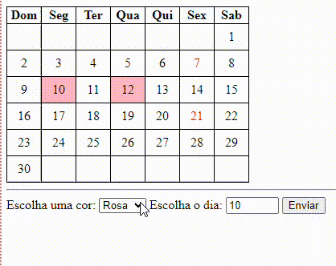

# Índice
[Projeto Cadastro com CEP]()  
[Descrição]()  
[Funcionalidades]()  
[Tecnologias Utilizadas]()  
[Fontes Consultadas]()  
[Autores]()  

# Projeto Cadastro utilizando CEP

## Descrição 
A Tela de Endereço Automático com Consulta por CEP é um projeto que visa simplificar e agilizar o processo de preenchimento de endereços em formulários online ou sistemas, permitindo que os usuários insiram apenas o CEP e obtenham automaticamente as informações detalhadas de endereço, como rua, bairro, cidade e estado. Esse projeto visa melhorar a experiência do usuário, reduzir erros de preenchimento e otimizar a coleta de informações.

### Funcionalidades
- Consulta por CEP
- Preenchimento automático
- Validação de CEP
- Autocompletar

## Tecnologias utilizadas

- GitHub
- Visual Studio Code (VSCode)
- HTML
- CSS
- JavaScript
- Bootstrap

### Fontes consultadas
[Bootstrap5](https://getbootstrap.com/docs/5.0/forms/layout/) 

### Autores
[Emily Pessoa](https://github.com/emilypessoa)

