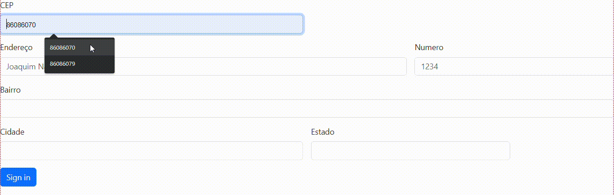

# Índice
[Projeto Cadastro com CEP](#projeto-cadastro-utilizando-cep)  
[Descrição](#descri%C3%A7%C3%A3o)  
[Funcionalidades](#funcionalidades)  
[Tecnologias Utilizadas](#tecnologias-utilizadas)  
[Fontes Consultadas](#fontes-consultadas)  
[Autores](#autores)  

# 👩🏻‍💻Projeto Cadastro utilizando CEP

## Descrição 
- Inicio do projeto em sala de aula 20/09/2023

A Tela de Endereço Automático com Consulta por CEP é um projeto que visa simplificar e agilizar o processo de preenchimento de endereços em formulários online ou sistemas, permitindo que os usuários insiram apenas o CEP e obtenham automaticamente as informações detalhadas de endereço, como rua, bairro, cidade e estado. Esse projeto visa melhorar a experiência do usuário, reduzir erros de preenchimento e otimizar a coleta de informações.

### Funcionalidades
- Consulta por CEP
- Preenchimento automático
- Validação de CEP
- Autocompletar

## Tecnologias utilizadas
- Utilizamos Arrow Function e Expressão regular.
- GitHub
- Visual Studio Code (VSCode)
- HTML
- JavaScript
- Bootstrap

## Fontes consultadas
### Bootstrap5

[Bootstrap5](https://getbootstrap.com/docs/5.0/forms/layout/)  
### Convertor video em GIF

[covertor de video em GIF](https://convertio.co/pt/mp4-gif/)

### Autores
[Emily Pessoa](https://github.com/emilypessoa)

